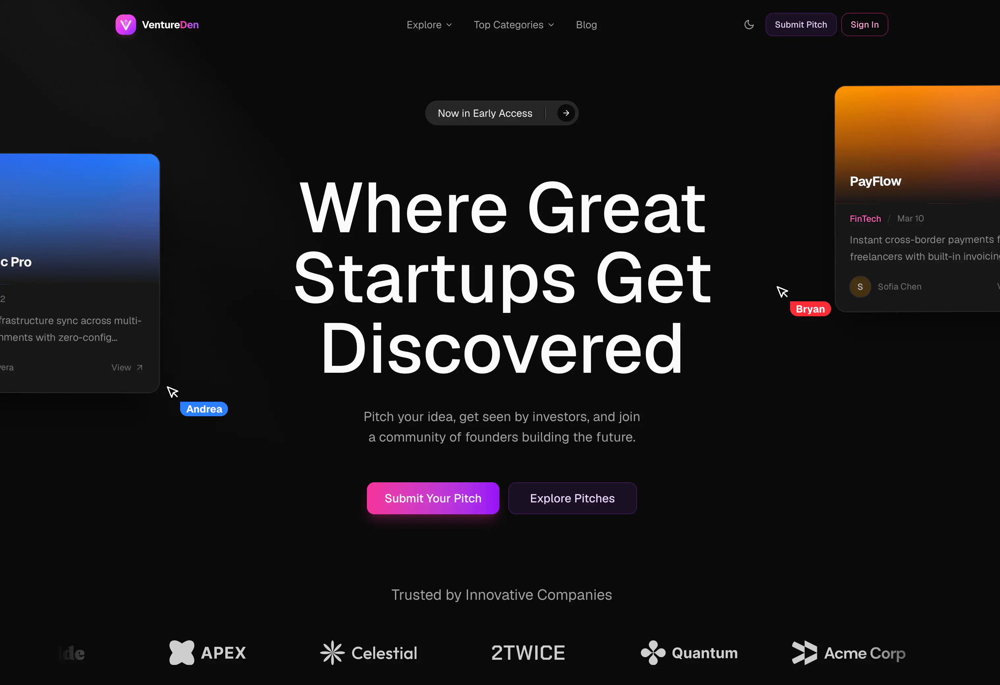
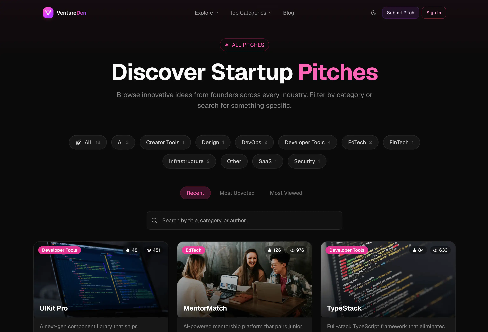
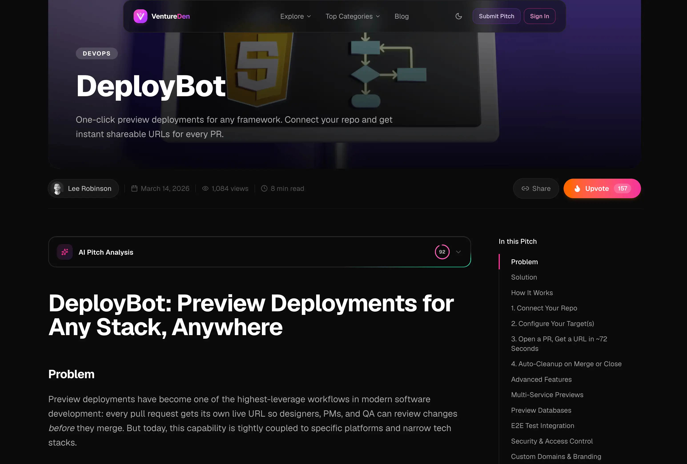

<a name="readme-top"></a>

<p align="center">
  
</p>

<p align="center">
  <h3 align="center">Ventureous</h3>
  <p align="center">
    An AI-powered startup pitch platform where founders pitch ideas, get instant AI feedback, and connect with investors
    <br />
    <a href="https://ventureous.zas512.in"><strong>Try it live »</strong></a>
    <br />
    <br />
    <a href="https://ventureous.zas512.in">Website</a>
    &middot;
    <a href="https://github.com/zas512/Ventureous/issues">Issues</a>
    &middot;
    <a href="https://github.com/zas512/Ventureous/issues/new?labels=enhancement">Request Feature</a>
  </p>
</p>

<p align="center">
  <a href="https://github.com/zas512">
    
  </a>
  <a href="https://github.com/zas512/Ventureous/stargazers">
    
  </a>
  <a href="https://github.com/zas512/Ventureous/forks">
    
  </a>
  <a href="https://github.com/zas512/Ventureous/blob/main/LICENSE">
    
  </a>
  <a href="https://www.typescriptlang.org/">
    
  </a>
  <a href="https://github.com/zas512/Ventureous/commits/main">
    
  </a>
  <a href="https://github.com/zas512/Ventureous/pulls">
    
  </a>
  
</p>

<details>
<summary>Table of Contents</summary>

- [About](#about)
- [Screenshots](#-screenshots)
- [Features](#-features)
- [Tech Stack](#-tech-stack)
- [Project Structure](#-project-structure)
- [Getting Started](#-getting-started)
- [Environment Variables](#-environment-variables)
- [Scripts](#-scripts)
- [Architecture](#-architecture)
- [Contributing](#-contributing)
- [Follow Me](#-follow-me)
- [Deployment](#-deployment)
- [Give A Star](#-give-a-star)
- [Star History](#-star-history)

</details>

## About

**Ventureous** is an **AI-powered startup pitch platform** where early-stage founders submit pitches, receive instant **AI analysis powered by Google Gemini**, and connect with a community of investors and builders. Browse and search startup ideas, upvote the best ones, leave feedback in the comments, and build a public founder profile — all on a blazing-fast **Next.js 16 + Sanity CMS** stack.

Every pitch is scored by AI across **clarity, market positioning, and uniqueness**, with actionable suggestions to sharpen the idea before it reaches investors. A fully editable, content-managed homepage and blog round out the experience, making Ventureous both a product and a complete, real-world reference for building a modern full-stack monorepo.

## 📸 Screenshots







## ✨ Features

| Area                     | What you get                                                                                                                                             |
| ------------------------ | -------------------------------------------------------------------------------------------------------------------------------------------------------- |
| **AI pitch analysis**    | Every pitch scored by Google Gemini on **clarity, market positioning & uniqueness** (0–100) plus a weighted overall score and 2–3 actionable suggestions |
| **Pitch submission**     | Multi-step create flow with a Novel / Tiptap rich-text editor (headings, lists, code, quotes, tasks) for the full pitch body                             |
| **Discover & search**    | Browse all pitches with category filters, sort by recent / upvotes / views, and instant client-side fuzzy search via Fuse.js                             |
| **Community engagement** | One-click upvotes, view counts, and threaded comments on every pitch                                                                                     |
| **Founder profiles**     | Public author pages with avatar, stats, and authored pitches — created automatically on first sign-in                                                    |
| **Authentication**       | GitHub OAuth via NextAuth v5; avatars uploaded to Sanity and an author document created on first login                                                   |
| **Headless CMS**         | Sanity Studio v5 with visual editing, live preview, and click-to-edit across a typed page builder                                                        |
| **Page builder**         | Composable homepage blocks — hero, logo ticker, top pitches, integrations, FAQ — editable by non-technical editors                                       |
| **Blog**                 | Rich-text articles with auto-generated table of contents and reading experience                                                                          |
| **SEO & sharing**        | Dynamic OG image generation, JSON-LD structured data, and per-page metadata                                                                              |
| **PWA**                  | Installable app with a service worker and offline fallback page                                                                                          |
| **Dark mode**            | System-aware light / dark theming via next-themes                                                                                                        |

## 🛠 Tech Stack

<details><summary><b>Ventureous</b> is built using the following technologies:</summary>

- [TypeScript](https://www.typescriptlang.org/): Typed superset of JavaScript.
- [Next.js](https://nextjs.org/) 16: React framework with App Router, React Compiler & Turbopack.
- [React](https://react.dev/) 19: UI library.
- [Sanity](https://www.sanity.io/) v5: Headless CMS with visual editing and live preview.
- [Tailwind CSS](https://tailwindcss.com/) v4: Utility-first CSS framework.
- [shadcn/ui](https://ui.shadcn.com/) + [Radix UI](https://www.radix-ui.com/): Accessible component primitives.
- [Google Gemini](https://ai.google.dev/): Generative AI for pitch analysis.
- [NextAuth.js](https://authjs.dev/) v5: Authentication with GitHub OAuth.
- [Motion](https://motion.dev/): Animation library for React.
- [Tiptap](https://tiptap.dev/) + [Novel](https://novel.sh/): Rich-text editing.
- [TanStack Query](https://tanstack.com/query) & [SWR](https://swr.vercel.app/): Client data fetching.
- [Fuse.js](https://www.fusejs.io/): Lightweight fuzzy search.
- [Zod](https://zod.dev/) + [T3 Env](https://env.t3.gg/): Schema & environment validation.
- [Turborepo](https://turbo.build/repo): Monorepo build orchestration & caching.
- [Biome](https://biomejs.dev/) + [Ultracite](https://ultracite.dev/): Fast linter & formatter.
- [npm](https://www.npmjs.com/): Package manager for JavaScript workspaces.
- [Vercel](https://vercel.com/): Deployment platform.

</details><br/>

[](https://zas512.in)

## 📂 Project Structure

Ventureous is an **npm + Turborepo monorepo** with two apps and shared packages:

```text
apps/
  web/      — Next.js 16 frontend (App Router, React 19, Tailwind v4, Turbopack)
  studio/   — Sanity Studio v5 (Vite, styled-components)
packages/
  env/                — Zod-validated environment variables (client + server)
  sanity/             — Sanity client, GROQ queries, live preview, generated types
  ui/                 — Shared Radix + CVA + Tailwind components (shadcn-style)
  logger/             — Structured logger
  typescript-config/  — Shared tsconfigs
```

## 🧰 Getting Started

1. Make sure [Git](https://git-scm.com/downloads), [Node.js 22+](https://nodejs.org/) and [npm 11+](https://www.npmjs.com/) are installed.
2. Fork this repository and clone **your fork**:

   ```bash
  git clone https://github.com/<your-username>/Ventureous.git
  cd Ventureous
   ```

3. Install dependencies:

   ```bash
  npm install
   ```

4. Add environment variables — create `apps/web/.env.local` and `apps/studio/.env.local` (see [Environment Variables](#-environment-variables)).

5. Start both apps:

   ```bash
  npm run dev
   ```

6. Open the frontend at [http://localhost:3000](http://localhost:3000) and the Sanity Studio at [http://localhost:3333](http://localhost:3333).

## 🔐 Environment Variables

**`apps/web/.env.local`**

```bash
NEXT_PUBLIC_SANITY_PROJECT_ID=
NEXT_PUBLIC_SANITY_DATASET=
NEXT_PUBLIC_SANITY_API_VERSION=
NEXT_PUBLIC_SANITY_STUDIO_URL=
SANITY_API_READ_TOKEN=
SANITY_API_WRITE_TOKEN=
AUTH_SECRET=
AUTH_GITHUB_ID=
AUTH_GITHUB_SECRET=
GEMINI_API_KEY=
```

**`apps/studio/.env.local`**

```bash
SANITY_STUDIO_PROJECT_ID=
SANITY_STUDIO_DATASET=
SANITY_STUDIO_TITLE=
SANITY_STUDIO_PRESENTATION_URL=
SANITY_STUDIO_API_VERSION=
```

> All variables are validated at startup with Zod via `@workspace/env`. Any new variable must also be added to `turbo.json` `globalEnv` so Vercel cache invalidation works.

## 📜 Scripts

Run from the repo root (Turborepo fans out to both apps):

| Command            | Description                                    |
| ------------------ | ---------------------------------------------- |
| `npm run dev`         | Run web (:3000) and studio (:3333) in dev mode |
| `npm run dev:web`     | Run only the Next.js app                       |
| `npm run dev:studio`  | Run only the Sanity Studio                     |
| `npm run build`       | Production build of all apps                   |
| `npm run lint`        | Lint with Biome / Ultracite                    |
| `npm run format`      | Format and auto-fix                            |
| `npm run check-types` | Type-check with TypeScript                     |

After editing any Sanity schema, regenerate types from `apps/studio`:

```bash
cd apps/studio
npm run extract   # write schema.json
npm run type      # regenerate packages/sanity/src/sanity.types.ts
```

## 🏗 Architecture

- **Content flow** — Schemas live in `apps/studio/schemaTypes/`; GROQ queries in `packages/sanity` are fetched server-side via a `defineLive` wrapper for automatic revalidation. All frontend types are derived from generated Sanity types.
- **Page builder** — An array of typed blocks rendered by `apps/web/src/components/pagebuilder.tsx`, mapping each `_type` to a React component with click-to-edit visual editing.
- **AI analysis** — `apps/web/src/lib/gemini.ts` calls Google Gemini; the response is validated with Zod (clarity / market positioning / uniqueness scores + suggestions) and rendered in the pitch detail view.
- **Auth** — NextAuth v5 with GitHub; on first sign-in the GitHub avatar is uploaded to Sanity and an `author` document is created, with the Sanity author `_id` carried through the session.

## 🔧 Contributing

[](https://github.com/zas512/Ventureous/graphs/contributors)

Contributions are what make the open source community such an amazing place to learn, inspire, and create. Any contributions you make are **greatly appreciated**.

1. Fork the repo
2. Create a new branch (`git checkout -b improve-feature`)
3. Make your changes
4. Commit your changes (`git commit -am 'Improve feature'`)
5. Push to the branch (`git push origin improve-feature`)
6. Open a Pull Request

Please read [CONTRIBUTING.md](CONTRIBUTING.md) and [SECURITY.md](SECURITY.md) before submitting.

## 🚀 Follow Me

[](https://github.com/zas512 "Follow Me")
[](https://www.linkedin.com/in/zas512)
[](https://twitter.com/intent/tweet?text=Check+out+Ventureous+-+an+AI-powered+startup+pitch+platform:&url=https%3A%2F%2Fgithub.com%2Fzas512%2FVentureous "Tweet about this project")

## 📃 Deployment

| Method                     | Description                              | Action                                                                                                                                               |
| :------------------------- | :--------------------------------------- | :--------------------------------------------------------------------------------------------------------------------------------------------------- |
| **🔧 Manual Build**        | Create an optimized production build.    | `npm run build`                                                                                                                                      |
| **▲ Vercel (Recommended)** | Deploy instantly on the Vercel platform. | [](https://vercel.com/new/clone?repository-url=https%3A%2F%2Fgithub.com%2Fzas512%2FVentureous) |

For more details, check the [Next.js deployment docs](https://nextjs.org/docs/deployment).

## ⭐ Give A Star

If you found this project useful, give it a star to help more people discover it!

## 🌟 Star History

<a href="https://star-history.com/#zas512/Ventureous&Timeline">
<picture>
  <source media="(prefers-color-scheme: dark)" srcset="https://api.star-history.com/svg?repos=zas512/Ventureous&type=Timeline&theme=dark" />
  <source media="(prefers-color-scheme: light)" srcset="https://api.star-history.com/svg?repos=zas512/Ventureous&type=Timeline" />
  
</picture>
</a>

<br />
<p align="right">(<a href="#readme-top">back to top</a>)</p>
